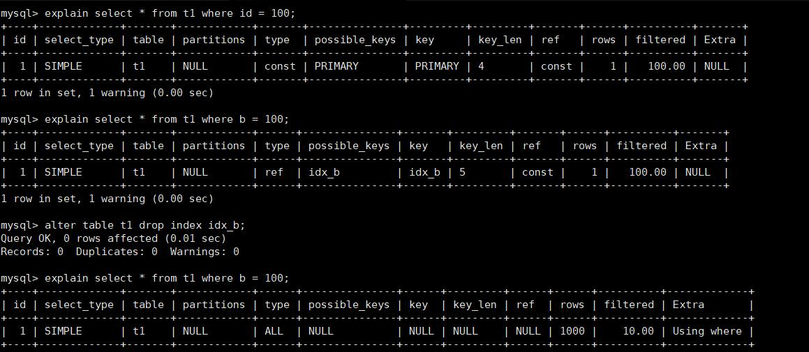
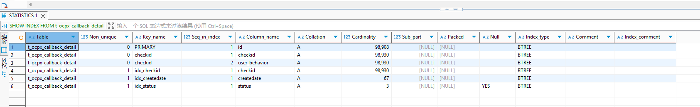
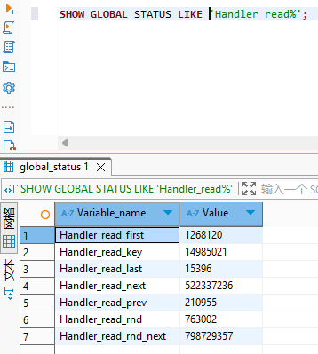

# 598.MySQL中使用索引一定有效吗？如何排查索引效果？

## 一、核心结论：索引不是一定有效

索引的本质是「用空间换时间」，但在很多场景下，MySQL 优化器会主动放弃索引，或者索引本身就会失效，导致性能反而不如全表扫描。

## 二、MySQL 索引生效 / 失效

### 🔍 流程图核心逻辑拆解

1. 第一层判断：索引是否会被优化器选中？

| 场景 | 结果 | 原理 |
| :--- | :--- | :--- |
| 小表（数据量极少） | 索引失效 | 全表扫描的 IO 成本 < 索引查找 + 回表的成本，优化器直接走全表 |
| 索引区分度极低（如性别字段） | 索引失效 | 索引 Cardinality 太低，扫描索引的成本接近全表，优化器放弃 |
| 统计信息过旧 | 索引失效 | 表数据大量变更后，MySQL 统计信息不准，优化器误判放弃索引 |
| 符合索引使用条件 | 索引生效 | 优化器选择最优索引执行查询 |

2. 第二层判断：索引是否会「人为失效」？

这是面试最常考的10 大索引失效场景，也是开发中最容易踩的坑

| 失效场景 | 错误示例 | 正确写法 | 原理 |
| :--- | :--- | :--- | :--- |
| 违反最左前缀原则（复合索引） | `idx(a,b,c)`，查询 `WHERE b=?` | `WHERE a=? AND b=?` | B+ 树索引必须从最左列开始匹配，否则无法定位 |
| 索引列参与计算 / 函数 | `WHERE YEAR(create_time)=2023` | `WHERE create_time BETWEEN '2023-01-01' AND '2023-12-31'` | 索引存储的是原始值，计算后无法匹配索引结构 |
| 索引列隐式类型转换 | `varchar(10)` 字段，`WHERE phone=13800138000` | `WHERE phone='13800138000'` | 字符串转数字会触发全表扫描，破坏索引有序性 |
| LIKE 以 % 开头 | `WHERE name LIKE '%张'` | `WHERE name LIKE '张%'` | 通配符在开头无法确定索引起始位置，只能全表扫描 |
| OR 连接条件（部分无索引） | `WHERE a=? OR b=?`（仅 a 有索引） | 拆分两个 UNION 查询，或给 b 加索引 | OR 条件中只要有一个字段无索引，整个查询全表扫描 |
| 索引列使用 !=/<>/NOT IN | `WHERE age != 18` | 尽量避免，或用覆盖索引优化 | 非等值查询会导致索引范围扫描效率低，优化器可能放弃 |
| 索引列使用 IS NULL/IS NOT NULL | `WHERE email IS NOT NULL` | 避免，或调整业务逻辑 | NULL 值在索引中存储特殊，非空判断易触发全表扫描 |
| 索引列使用 ORDER BY 不符合顺序 | `idx(a,b)`，`ORDER BY b` | `ORDER BY a,b` | ORDER BY 需匹配索引顺序，否则触发 Using filesort |
| 索引列参与 GROUP BY 不符合顺序 | `idx(a,b)`，`GROUP BY b` | `GROUP BY a,b` | GROUP BY 需先排序，不符合索引顺序会触发临时表 |
| 索引被覆盖（回表成本高） | `SELECT * FROM table WHERE a=?`（大表） | 用覆盖索引 `idx(a,col1,col2)` | 回表查询的 IO 成本过高，优化器可能选择全表扫描 |

## 三、如何排查索引效果？（面试必背的 3 大工具）

### 1. 核心神器：EXPLAIN 执行计划（90% 的排查靠它）

在 SQL 前加 EXPLAIN，重点看 4 个核心字段



| 字段 | 核心含义 | 索引生效判断标准 |
| :--- | :--- | :--- |
| `type` | 访问类型（性能从优到劣） | `system` > `const` > `eq_ref` > `ref` > `range` > `index` > `ALL`<br>**目标**：至少达到 `range`，`ALL` 代表全表扫描（索引失效） |
| `key` | 实际使用的索引 | `NULL` = 未使用索引（失效）；非 `NULL` = 实际使用的索引名 |
| `rows` | 预估扫描行数 | 值越小越好，越大说明索引过滤效果越差 |
| `Extra` | 额外信息（关键预警） | - `Using index`：覆盖索引，无需回表（最优）<br>- `Using filesort`：需外部排序（索引失效，需优化）<br>- `Using temporary`：使用临时表（索引失效，需优化）<br>- `Using where`：正常，代表用 WHERE 过滤 |

实操示例：

```mysql
-- 索引失效示例（type=ALL，key=NULL）
EXPLAIN SELECT * FROM user WHERE YEAR(create_time) = 2023;

-- 索引生效示例（type=range，key=idx_create_time）
EXPLAIN SELECT * FROM user WHERE create_time BETWEEN '2023-01-01' AND '2023-12-31';
```

### 2. 索引统计信息排查：SHOW INDEX

查看索引的区分度（Cardinality），判断索引是否有价值：

```mysql
SHOW INDEX FROM 表名;
```



- 核心看 **Cardinality** 列：值越高，索引区分度越好，越容易被优化器选中
- 若 **Cardinality** 接近表总行数，说明索引效果好；若接近 0，说明索引几乎无效

### 3. 索引使用监控：SHOW STATUS

实时监控索引的实际使用情况，排查是否有索引从未被使用：

```mysql
-- 查看索引读取次数
SHOW GLOBAL STATUS LIKE 'Handler_read%';
```


- **Handler_read_key**：通过索引读取的次数（越高越好）
- **Handler_read_rnd_next**：全表扫描读取的次数（越低越好）
- 若 **Handler_read_key** 极低，说明索引几乎没被使用

## 四、面试加分项：索引优化的核心原则

1. **最左前缀原则**：复合索引把高频查询、高区分度的列放在最前面
2. **避免索引列计算**：永远不要在索引列上使用函数、运算、类型转换
3. **覆盖索引优化**：把查询需要的列都放到索引里，避免回表
4. **小表不建索引**：数据量小于 1000 行的表，全表扫描比索引更快
4. **定期更新统计信息**：ANALYZE TABLE 表名; 避免优化器误判

## 五、面试答题话术（直接背）

**面试官问：MySQL 中使用索引一定有效吗？如何排查索引效果？**  

答：**索引不是一定有效**，主要有两类情况会导致索引失效：

1. **优化器主动放弃**：比如小表全表扫描成本更低、索引区分度太低、统计信息过旧；
2. **人为使用不当**：比如违反最左前缀、索引列参与计算、LIKE% 开头、隐式类型转换等 10 大场景。


排查索引效果的核心方法是用 EXPLAIN 分析执行计划，重点看 type（是否全表扫描）、key（是否用索引）、rows（扫描行数）、Extra（是否有 filesort/temporary）；同时可以用 SHOW INDEX 查看索引区分度，用 SHOW STATUS 监控索引实际使用情况。