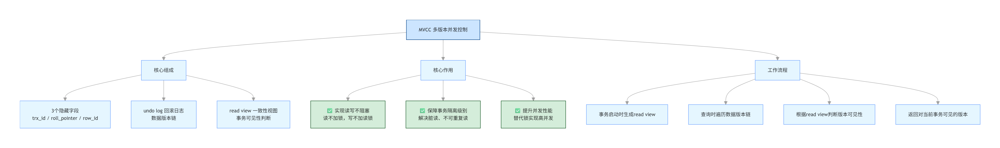

# 604.MySQL中的MVCC是什么？

## 一、核心定义

**MVCC（Multi-Version Concurrency Control，多版本并发控制）** 是 MySQL InnoDB 引擎实现的**并发控制机制**，核心作用是：
> 在不加锁的前提下，解决事务并发读写冲突，实现「读不加锁、读写不阻塞」，同时保障事务隔离级别（尤其是可重复读 RR）。

简单来说：**MVCC = 数据多版本 + 一致性视图 + 读写分离**，是 InnoDB 实现高并发事务的核心技术。

举个生活例子，你就秒懂它的价值：
> 你去银行查余额（读操作），柜员正在给你办转账（写操作）。
>
> - 传统锁机制：柜员办转账时，把账户「锁起来」，你查余额必须等转账办完，读写互相等，慢死了
> - MVCC 机制：柜员给你办转账时，系统自动给账户拍了一张「转账前的快照」，你查余额直接读快照，不用等转账，读写互不耽误，并发拉满

**一句话总结 MVCC 的本质**：给数据拍「历史快照」，让读操作读快照、写操作改最新数据，实现「读写不打架」，同时保证数据一致性。

## 二、MVCC 核心原理流程图

## 三、MVCC 三大核心组件（面试必背）

### 1. 3 个隐藏字段（数据版本的基础）
   
InnoDB 会给每一行数据自动添加 3 个隐藏列，是 MVCC 的基础：

| 字段名 | 作用 |
| :--- | :--- |
| `DB_TRX_ID` | 最近一次修改 / 插入该行数据的事务 ID（事务自增 ID） |
| `DB_ROLL_PTR` | 回滚指针，指向该行数据的上一个版本（串联成版本链） |
| `DB_ROW_ID` | 行 ID，若表无主键，InnoDB 自动生成的聚簇索引 ID |

**举个例子：**

- 初始数据：`余额=1000`，`trx_id=1`（事务 1 创建的），`roll_ptr=null`（没有上一版）
- 事务 2 把余额改成`2000`：新数据`余额=2000`，`trx_id=2`，`roll_ptr`指向`余额=1000`的旧版本
- 事务 3 把余额改成`3000`：新数据`余额=3000`，`trx_id=3`，`roll_ptr`指向`余额=2000`的旧版本
- 最终形成一条**版本链**：`3000(trx3) → 2000(trx2) → 1000(trx1)`

### 2. undo log（回滚日志 + 版本链）

- **作用**：存储数据的历史版本，通过DB_ROLL_PTR串联成版本链
- 当事务修改数据时，会把修改前的旧数据写入 undo log，新数据保留最新事务 ID
- 事务回滚时，通过 undo log 恢复数据；MVCC 查询时，通过版本链找到对当前事务可见的版本

### 3. read view（一致性视图）
   
- 作用：事务启动时生成的「数据可见性规则」，决定了哪些数据版本对当前事务可见
- 核心 4 个参数：
   1. **m_ids**：**当前正在办事的人列表**，当前活跃（未提交）的事务 ID 列表
   2. **min_trx_id**：**正在办事的人里，最早来的那个**，m_ids中的最小事务 ID
   3. **max_trx_id**：**下一个要办事的人的工号**，下一个即将分配的事务 ID（全局最大事务 ID+1）
   4. **creator_trx_id**：**你自己的工号**，当前事务自己的 ID

- 可见性判断规则（面试核心）：

  对于某行数据的**DB_TRX_ID**：
   1. 若**trx_id == creator_trx_id**：当前事务修改的，可见
   2. 若**trx_id < min_trx_id**：事务已提交，可见
   3. 若**trx_id >= max_trx_id**：事务在 read view 生成后启动，不可见
   4. 若**min_trx_id <= trx_id < max_trx_id**：判断trx_id是否在m_ids中，不在则可见，在则不可见

## 四、MVCC 工作流程（面试必背）
1. **事务启动**：生成当前事务的read view一致性视图
2. **执行查询**：遍历数据的版本链（从最新版本开始）
3. **可见性判断**：根据read view规则，判断每个版本是否对当前事务可见
4. **返回结果**：找到第一个可见的版本，返回给用户
5. **事务提交**：版本链保留，后续事务可基于历史版本查询

我们用一个真实场景，走一遍完整流程，你就彻底懂了：

**场景设定**

- 初始数据：`余额=1000`，`trx_id=1`（事务 1 创建）
- 事务 A：查余额（读操作）
- 事务 B：把余额改成`2000`，还没提交（写操作）

**步骤 1：事务 A 启动，生成「read view 白名单」**

事务 A 启动时，系统给它生成一份白名单：

- `m_ids = [2]`（事务 B 正在办事，没提交）
- `min_trx_id = 2`（正在办事的最小 ID）
- `max_trx_id = 3`（下一个要分配的 ID）
- `creator_trx_id = 3`（事务 A 自己的 ID）

**步骤 2：事务 A 执行查询，遍历「版本链」**

事务 A 要查余额，从版本链的**最新版本**开始看：
- 最新版本：`余额=2000`，`trx_id=2`（事务 B 修改的）
- 旧版本：`余额=1000`，`trx_id=1`（事务 1 创建的）

**步骤 3：用「read view 白名单」判断「能不能看」**
按规则判断`trx_id=2`的版本：

1. 是不是自己改的？`2 != 3` → 不是
2. 是不是比最早办事的人还早？`2 < 2`？ → 不是
3. 是不是比下一个办事的人还晚？`2 >= 3`？ → 不是
4. 是不是在「正在办事的列表」里？`2 在 [2] 里` → 是！**不能看**

于是事务 A 继续往下找，找到`trx_id=1`的版本：

1. 是不是自己改的？`1 != 3` → 不是
2. 是不是比最早办事的人还早？`1 < 2` → 是！可以看

**步骤 4：返回可见版本，完成查询**

事务 A 最终读到`余额=1000`，完全不受事务 B 的未提交修改影响，**完美解决脏读！**

## 五、MVCC 解决的核心问题
1. 解决并发读写冲突，实现「读写不阻塞」
   - 传统锁机制：读加共享锁，写加排他锁，读写互斥，并发性能差
   - MVCC：读操作基于历史版本（快照读），不加锁；写操作修改最新版本，加行锁
   - 实现**读不阻塞写，写不阻塞读**，大幅提升并发性能
2. 保障事务隔离级别
   - **读未提交（RU）**：直接读取最新版本，无需 MVCC
   - **读已提交（RC）**：每次查询都生成新的read view，解决脏读，存在不可重复读
   - **可重复读（RR，MySQL 默认）**：事务启动时生成一次read view，整个事务内基于同一视图查询，解决不可重复读
   - **串行化（S）**：完全加锁，无需 MVCC
3. **解决脏读、不可重复读（配合 Next-Key Lock 解决幻读）**
   - 脏读：通过read view过滤未提交事务的修改，仅读取已提交版本
   - 不可重复读：RR 级别下，事务内read view不变，多次读取同一版本，结果一致
   - 幻读：MVCC 解决「快照读」的幻读，配合 Next-Key Lock（间隙锁）解决「当前读」的幻读

## 六、面试答题话术（直接背）

>**面试官问：MySQL 中的 MVCC 是什么？**
>
>答：MVCC 是 Multi-Version Concurrency Control，即多版本并发控制，是 MySQL InnoDB 引擎实现的核心并发控制机制。
> 
> 它的核心原理是：给每行数据维护多个历史版本，通过`undo log`串联成版本链，事务启动时生成read view一致性视图，查询时根据视图规则找到对当前事务可见的版本，实现读不加锁、读写不阻塞，大幅提升并发性能。
> 
> MVCC 主要解决了两个核心问题：一是解决事务并发读写冲突，实现读写分离，提升并发性能；二是保障事务隔离级别，在 RR 级别下解决脏读、不可重复读，配合 Next-Key Lock 解决幻读，是 InnoDB 实现高并发事务的核心技术。
>
> 它的三大核心组件是：行数据的 3 个隐藏字段（trx_id/roll_pointer/row_id）、undo log版本链、read view一致性视图。
> 
> 
>

## 六、MVCC 怎么解决「幻读」？（通俗版）

很多人搞不懂幻读，用大白话讲：
> 幻读就是：你查「年龄 > 20 的用户」，第一次查到 10 个，事务没提交，别人插入了 1 个符合条件的，你再查就变成 11 个，像出现了幻觉。

**MVCC 解决「快照读」的幻读**
- 原理：事务 A 启动时生成`read view`，所有查询都基于这份白名单，别人插入的新数据`trx_id`在`max_trx_id`之后，**直接被白名单过滤，永远读不到**
- 效果：事务 A 两次查询都是 10 个，不会出现新数据，解决幻读

**Next-Key Lock 解决「当前读」的幻读**
- 什么是当前读：`SELECT ... FOR UPDATE、UPDATE、DELETE`，必须读最新数据，不能读快照
- 原理：给「索引记录 + 索引之间的间隙」加锁，别人根本插不进去数据，自然不会出现幻读
- 一句话：**MVCC 管快照读，间隙锁管当前读，双管齐下彻底解决幻读**
