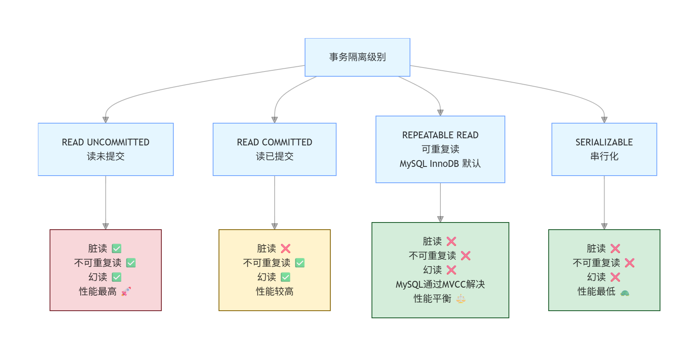

# 606.MySQL中的事务隔离级别有哪些？

## 一、核心结论：MySQL 4 种事务隔离级别

SQL 标准定义了 4 种隔离级别，MySQL InnoDB 引擎**全部支持**，默认隔离级别为 **REPEATABLE READ（可重复读）**。

## 二、隔离级别 & 脏读 / 不可重复读 / 幻读 对应流程图

## 三、3 个并发问题的定义（面试必背）

先搞懂隔离级别要解决的问题，才能理解级别差异：

| 问题 | 定义 | 场景示例 |
| :--- | :--- | :--- |
| 脏读（Dirty Read） | 一个事务读取了另一个未提交事务修改的数据 | 事务 A 修改了数据但未提交，事务 B 读取了该数据，随后 A 回滚，B 读到了无效的「脏数据」 |
| 不可重复读（Non-Repeatable Read） | 同一事务内，两次相同查询得到不同结果（因为中间有其他事务提交了修改） | 事务 A 第一次读余额 100，事务 B 修改余额为 200 并提交，A 第二次读余额变成 200，同一事务内结果不一致 |
| 幻读（Phantom Read） | 同一事务内，两次相同范围查询，第二次读到了第一次没有的「新数据」（因为中间有其他事务插入了数据） | 事务 A 查询 `age > 20` 有 10 条数据，事务 B 插入了 1 条 `age = 25` 的数据并提交，A 再次查询得到 11 条，像出现了「幻觉」 |

## 四、4 种隔离级别详细解析

1. **READ UNCOMMITTED（读未提交）**
   - **核心特性**：事务可以读取其他事务未提交的数据
   - **解决问题**：无（脏读、不可重复读、幻读全部存在）
   - **性能**：最高（几乎无锁，无隔离开销）
   - **适用场景**：极少使用，仅对数据一致性要求极低的场景（如实时统计、日志分析）
2. **READ COMMITTED（读已提交，RC）**
   - **核心特性**：事务只能读取其他事务已经提交的数据
   - **解决问题**：✅ 解决脏读；❌ 仍存在不可重复读、幻读
   - **性能**：较高
   - **适用场景**：Oracle、SQL Server 的默认隔离级别，适合对一致性要求一般、追求性能的系统
3. **REPEATABLE READ（可重复读，RR，MySQL InnoDB 默认）**
   - **核心特性**：同一事务内，多次读取同一数据的结果始终一致
   - **解决问题**：✅ 解决脏读、不可重复读；✅ MySQL 通过 MVCC（多版本并发控制）+ Next-Key Lock 解决了幻读（SQL 标准中 RR 仍存在幻读）
   - **性能**：平衡（兼顾一致性与性能）
   - **适用场景**：绝大多数业务系统（电商、金融等），MySQL 生产环境默认级别
4. **SERIALIZABLE（串行化）**
   - **核心特性**：所有事务串行执行，完全隔离
   - **解决问题**：✅ 解决脏读、不可重复读、幻读（彻底解决所有并发问题）
   - **性能**：最低（完全串行，并发能力极差）
   - **适用场景**：对数据一致性要求极高、并发量极低的场景（如金融核心对账、审计系统）

## 五、隔离级别对照表（面试速记）

| 隔离级别 | 脏读 | 不可重复读 | 幻读 | 锁机制 | 性能 | 适用场景 |
| :--- | :--- | :--- | :--- | :--- | :--- | :--- |
| 读未提交（RU） | ✅ 存在 | ✅ 存在 | ✅ 存在 | 无锁 | 最高 | 极少使用 |
| 读已提交（RC） | ❌ 解决 | ✅ 存在 | ✅ 存在 | 行锁 | 较高 | Oracle 默认，一般业务 |
| 可重复读（RR） | ❌ 解决 | ❌ 解决 | ❌ 解决（MySQL） | MVCC + Next-Key Lock | 平衡 | MySQL 默认，绝大多数业务 |
| 串行化（S） | ❌ 解决 | ❌ 解决 | ❌ 解决 | 表锁 | 最低 | 高一致性、低并发场景 |