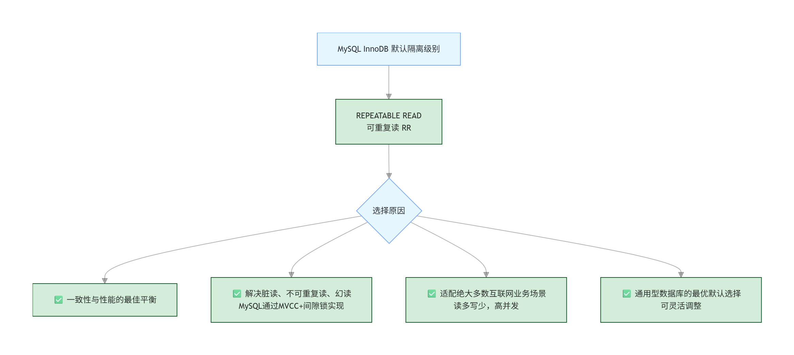

# 607.MySQL 默认事务隔离级别是什么？为什么选择这个级别？

## 一、核心结论

MySQL **InnoDB 存储引擎**的默认事务隔离级别是：**REPEATABLE READ（可重复读，简称 RR）**
> 补充：MyISAM 引擎不支持事务，无隔离级别概念；SQL 标准中 RR 级别仍存在幻读，但 MySQL 通过 MVCC + Next-Key Lock 彻底解决了幻读问题。

## 二、为什么选择「可重复读」作为默认级别？

### 1. 核心设计逻辑：一致性与性能的最佳平衡

MySQL 选择 RR 作为默认级别，是在「数据一致性」和「并发性能」之间做了最优权衡，我们用对比表说明：

| 隔离级别 | 一致性 | 性能 | 问题 |
| :--- | :--- | :--- | :--- |
| 读未提交（RU） | 极差 | 最高 | 存在脏读，完全不满足业务一致性要求 |
| 读已提交（RC） | 一般 | 较高 | 存在不可重复读，无法保证同一事务内数据一致性 |
| 可重复读（RR） | 优秀 | 平衡 | 解决脏读、不可重复读，MySQL 额外解决幻读，兼顾性能 |
| 串行化（S） | 完美 | 极低 | 完全串行，并发能力极差，无法满足互联网高并发场景 |

### 2. 详细原因拆解（面试必背 4 点）

**① 满足绝大多数业务的一致性需求**
- 电商、金融、社交等绝大多数互联网业务，核心要求是：同一事务内多次读取同一数据，结果必须一致
- RR 级别通过 MVCC（多版本并发控制） 实现「快照读」，事务启动时生成一致性视图，基于视图读取数据，彻底解决了「不可重复读」问题
- 同时，MySQL 用 Next-Key Lock（间隙锁 + 行锁） 解决了 SQL 标准中 RR 级别仍存在的「幻读」问题，让 RR 级别在一致性上几乎等同于串行化

**② 并发性能远高于串行化，满足高并发场景**
- 串行化级别通过「全表锁」实现完全隔离，并发能力极差，无法支撑互联网高并发业务
- RR 级别基于 MVCC 实现「无锁快照读」，读操作不加锁，写操作仅加行锁，并发性能远高于串行化，同时远高于 RC 级别的一致性
- 完美适配「读多写少」的互联网业务场景，是性能与一致性的黄金平衡点

**③ 符合 MySQL 的核心定位：通用型关系型数据库**
- MySQL 作为全球最流行的开源关系型数据库，核心目标是「适配绝大多数业务场景」
- RR 级别既满足了金融级的一致性要求，又能支撑互联网高并发，是通用场景下的最优选择
- 而 Oracle、SQL Server 选择 RC 作为默认级别，是因为其业务场景更偏向企业级，对一致性要求相对较低，追求极致性能

**④ 可灵活调整，适配特殊场景**
- RR 是默认级别，但 MySQL 支持动态修改隔离级别：
  - 对一致性要求极高的场景：可手动升级为 SERIALIZABLE
  - 对性能要求极高、一致性要求低的场景：可手动降级为 READ COMMITTED
- 这种「默认最优 + 灵活调整」的设计，让 MySQL 适配了从互联网到金融的全场景业务

## 三、配套流程图

## 四、面试答题话术（直接背）

面试官问：MySQL 默认的事务隔离级别是什么？为什么选择这个级别？

答：MySQL InnoDB 引擎的默认事务隔离级别是 可重复读（REPEATABLE READ，RR）。选择这个级别作为默认，核心是**在数据一致性和并发性能之间做了最优平衡**：

1. **一致性保障**：RR 级别通过 MVCC 解决了脏读、不可重复读，同时 MySQL 用 Next-Key Lock（间隙锁 + 行锁）额外解决了 SQL 标准中 RR 级别存在的幻读，一致性几乎等同于串行化；
2. **并发性能优异**：基于 MVCC 实现无锁快照读，读操作不加锁，写操作仅加行锁，并发性能远高于串行化，完美适配互联网「读多写少」的高并发场景；
3. **通用场景适配**：作为通用型开源数据库，RR 级别既满足了电商、金融等业务的一致性要求，又能支撑高并发，是绝大多数业务的最优选择；
4. **灵活可调整**：默认 RR 级别，同时支持动态修改隔离级别，可根据业务需求灵活升级 / 降级，适配全场景业务。